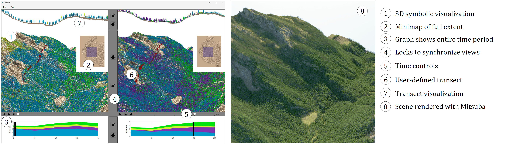
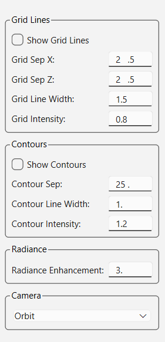
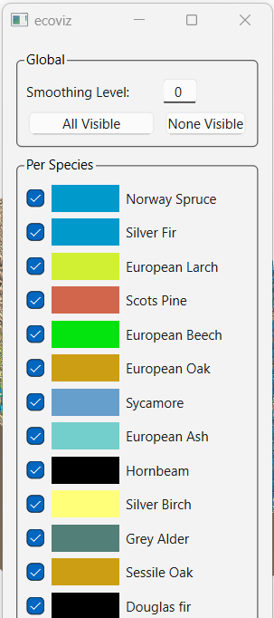
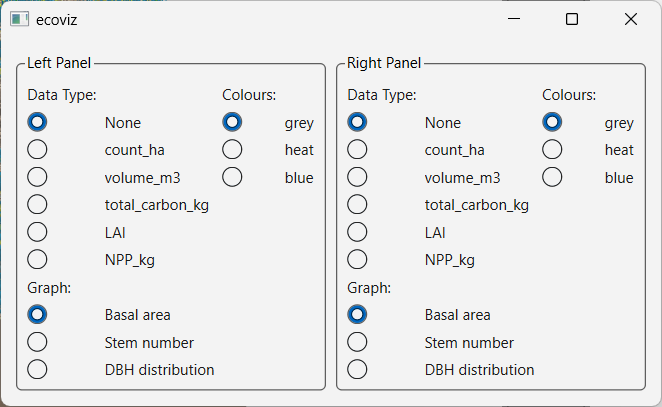
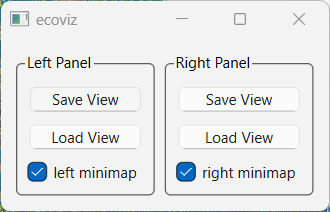
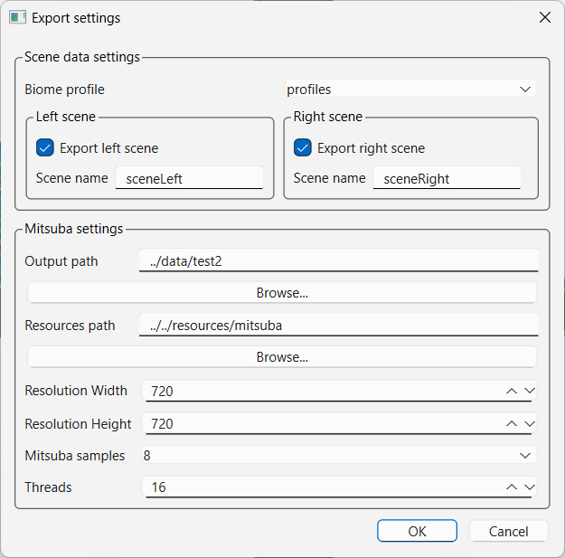

# EcoViz User Manual

## 1. Introduction

### What is EcoViz?

EcoViz is a specialized software tool designed for the visual analysis and photorealistic rendering of forest landscape model simulations. Developed in C++ with the Qt6 framework, it provides an interactive 3D interface to explore complex ecological data.

The primary purpose of EcoViz is to visualize and compare simulated landscape trajectories, such as those generated by the iLand model. It allows researchers and practitioners to study forest dynamics under different conditions (e.g., baseline vs. climate change scenarios) and across various spatial and temporal scales.

### Key Features

-   **Side-by-Side Comparison**: Display two scenarios simultaneously in linked views for direct comparison of landscape dynamics.
-   **Multi-Scale Analysis**: Visualize landscapes at different scales, from a broad landscape view (\~1000 ha) down to the detailed stand level (\~6 ha).
-   **Temporal Analysis**: Use an interactive timeline to observe forest dynamics over time, including disturbance events and subsequent recovery.
-   **Symbolic Rendering**: View vegetation with species differentiated by color for clear, analytical visualization of species composition and distribution.
-   **Transect Analysis**: Select a cross-section of the terrain to view a detailed 2D profile of the vegetation structure.
-   **Photorealistic Rendering**: Export scenes to Mitsuba, an open-source, physically-based rendering engine, to create high-quality, realistic images for publications and presentations.





### Source Code

The full source code for EcoViz is available on GitHub: <https://github.com/jgain/EcoViz>

------------------------------------------------------------------------

## 2. Hardware Recommendations

EcoViz is a graphically intensive application that performs best on workstation-type machines with a fast CPU and a dedicated GPU.

-   **Recommended Setup**: A modern PC with a dedicated NVIDIA or AMD graphics card. On this hardware, startup times for the included demo landscape are typically between 20-30 seconds.
-   **Apple Silicon**: Modern Apple laptops (M3, M4 and later) are also well-suited for running EcoViz, as their integrated GPUs offer strong performance.
-   **Basic Laptops**: While EcoViz can run on typical laptops without a dedicated GPU, users should expect longer loading times and less fluid 3D navigation.
-   **Memory (RAM)**: Memory requirements depend on the size of the landscape data and the number of simulation time steps. As a baseline, the included demo landscape requires approximately 4GB of free RAM.

------------------------------------------------------------------------


## 3. Getting Started

### System Prerequisites

Before installing EcoViz, ensure your system meets the following requirements:

-   **Operating System**: Windows, macOS, or Ubuntu.
-   **C++ Compiler**: A modern C++ compiler (e.g., GCC, Clang, MSVC).
-   **Qt6 Framework**: Including the QtCharts module.
-   **Other Dependencies**: CMake, Boost, GLM, GLEW, and SQLite3.

### Installation and Setup

For detailed installation and build instructions, please refer to the guide for your operating system:

-   **Windows**: [Windows Installation Guide](README-Ecoviz-Windows.md)
-   **macOS**: [macOS Installation Guide](README-EcoViz-Mac.txt)
-   **Ubuntu**: [Ubuntu Installation Guide](README-EcoViz.txt)

------------------------------------------------------------------------

## 4. Launching EcoViz

EcoViz is launched from the command line, which allows you to specify the data to be loaded.

-   **Windows**: The executable is `ecoviz.exe`, typically found in the `ecoviz/out` directory.
-   **macOS/Linux**: The executable is `ecoviz`, typically found in the `ecoviz/build/viz/` directory.

The demo package includes a convenience script, **`start_ecoviz_wbt.cmd`**, which starts the software with the Klausbachtal demo project. In this demo, the baseline simulation appears in the left view and the climate change scenario in the right.

### Command-Line Parameters

You can load your own data using the following parameters:

-   **`-prefix <basename>`**: Loads the same dataset for both the left and right displays. The `basename` should not include a file extension.

    ``` bash
    # Example for Linux/macOS
    ./viz/ecoviz -prefix ecoviz ../../data/test2
    ```

-   **`-lprefix <basename>`**: Specifies the base filename for the dataset in the **left** window.

-   **`-rprefix <basename>`**: Specifies the base filename for the dataset in the **right** window.

------------------------------------------------------------------------

## 5. User Interface Guide

The EcoViz interface is divided into multiple panels, including two main 3D scene views, a transect view, and a timeline.

### Navigation and Camera Controls

EcoViz offers two primary camera modes for navigating the 3D scene. You can switch between them using the **F2** key, the "View" menu, or the "Terrain Options" panel.

#### Orbit Mode

Orbit mode is ideal for inspecting the terrain from a distance. The camera rotates around a central focal point, marked by a vertical "stick" (toggle with the **F** key).

-   **Rotate View**: **Right-click + drag** the mouse.
-   **Zoom**: Use the **mouse wheel**.
-   **Pan (Move Focal Point)**: Use the **W, A, S, D** or **Arrow** keys.
-   **Set New Focal Point**: **Double-right-click** on any point on the terrain.
-   **Top-Down View**: Press the **V** key to snap to a top-down orthographic view.

#### Flyover Mode

Flyover mode provides a first-person perspective for exploring the scene from within. The camera follows the terrain, creating a "walking" or "hovering" effect.

-   **Look Around**: **Right-click + drag** the mouse.
-   **Move Forward/Backward**: Use the **W/S** keys, **Up/Down Arrow** keys, or the **mouse wheel**.
-   **Strafe Left/Right**: Use the **A/D** keys or **Left/Right Arrow** keys.
-   **Elevator Up/Down**: Use **Page Up** and **Page Down** to move vertically.
-   **Reset View**: If you get lost, press the **R** key to reset the camera to a level, north-facing view 50 meters above your current position.

**Pro Tip**: Combine modes for efficient navigation. Use Orbit mode to find an interesting area, double-right-click to set the focal point, and press **F2** to switch to Flyover mode to explore that location on foot.

### Key UI Components

-   **Minimap**: Press **'m'** to toggle the minimap. In the minimap, **left-click and drag** to move the current selection, or **right-click and drag** to define a new viewing region.
-   **Link Views**: Use the **lock symbols** between the two 3D views to synchronize their camera positions.
-   **Timeline**: The media bar at the bottom allows you to play, pause, or step through the simulation years.

------------------------------------------------------------------------

## 6. Visualization Features

EcoViz provides several dialogs to customize the visualization. These can be accessed from the **"View"** menu.

### View Menu Panels

-   **Show Terrain Options**: Toggle grid lines and contours, adjust their properties, and switch between camera modes.

    {width="200"}

-   **Show Plant Options**: Control the visibility of individual tree species or hide/show all plants. A smoothing level can also be applied.

    {width="200"}

-   **Show DataMap Options**: Overlay various data maps (e.g., "Sunlight," "Moisture") on the terrain, with customizable color ramps.

    {width="400"}

-   **Show View Controls**: Save the current camera viewpoint to a file or load a previously saved one.

    {width="200"}

-   **Clear Transects**: Removes the currently defined transect from the scene.

-   **Show Startup Log**: Displays the log with information about the application's loading process.

### Transects

A transect provides a 2D cross-sectional view of the forest.

-   **Create a Transect**: Hold **Ctrl** and **left-click** on two points on the terrain to define the start and end points.
-   **Adjust Transect Width**: Use **Ctrl + mouse wheel** to widen or narrow the transect.
-   **Navigate Transect View**: In the transect panel at the top, use the **right mouse button** to pan and the **mouse wheel** to zoom.

------------------------------------------------------------------------

## 7. Photorealistic Rendering with Mitsuba

For high-quality, photorealistic images, EcoViz integrates with the Mitsuba rendering engine.

### Exporting a Scene to Mitsuba

1.  Go to **File -\> Export Mitsuba**.

    

2.  **Specify an Output Path**: This is the directory where Mitsuba's scene files (including a JSON file) will be saved.

3.  **Set the Resources Path**: This path must point to the directory containing the 3D tree models and textures. In the provided package, this is `resources/mitsuba`.

4.  Configure other settings like resolution and render quality.

5.  Click **Export**. After exporting, you can use Mitsuba to render the generated scene file. For a complete walkthrough, refer to the dedicated guide:

-   [Rendering with Mitsuba Guide](README-Rendering-Mitsuba.md)

------------------------------------------------------------------------

## 8. Working with Custom Data

### Data Formats

EcoViz loads vegetation data from two file formats: a text-based **`.pdb`** and a binary **`.pdbb`**. The binary format is strongly preferred as it loads much faster and uses less disk space.

For a complete specification of the file formats, please see the [Data File Format Guide](README-FileFormat.md).

#### Text-Based PDB File Format (`.pdb`)

This format is human-readable. It contains a header with metadata followed by data for individual trees and cohorts.

| Field               | Data Type | Example  | Description                                  |
|-------------|-------------|-------------|---------------------------------|
| PDB Version         | String    | `"3.0"`  | File format version.                         |
| World Origin (X, Y) | Double    | `253323` | Metric coordinates of the world origin.      |
| Time Step           | Integer   | `1`      | Simulation year.                             |
| Tree/Cohort Data    | ...       | ...      | One line per tree or cohort with attributes. |

#### Binary PDBB File Format (`.pdbb`)

This is a compact, binary representation of the same data, optimized for performance.

| Field                    | C++ Data Type | Size (Bytes) | Description                       |
|------------------|---------------|---------------|-------------------------|
| Version String Length    | `int`         | 4            | Length of the version string.     |
| Version String           | `char[]`      | `slen`       | The version string itself.        |
| World Origin X           | `int64_t`     | 8            | X-coordinate of the world origin. |
| World Origin Y           | `int64_t`     | 8            | Y-coordinate of the world origin. |
| Time Step                | `int`         | 4            | The simulation year.              |
| Tree/Sapling Data Blocks | ...           | ...          | Contiguous blocks of binary data. |

### Converting Data to Binary

A command-line tool, **`ecosimtobin`**, is provided in the `ecoviz/tools` directory to convert your text-based `.pdb` files to the binary `.pdbb` format. Run the tool without arguments to see usage instructions. This is a crucial step for working with large datasets.
